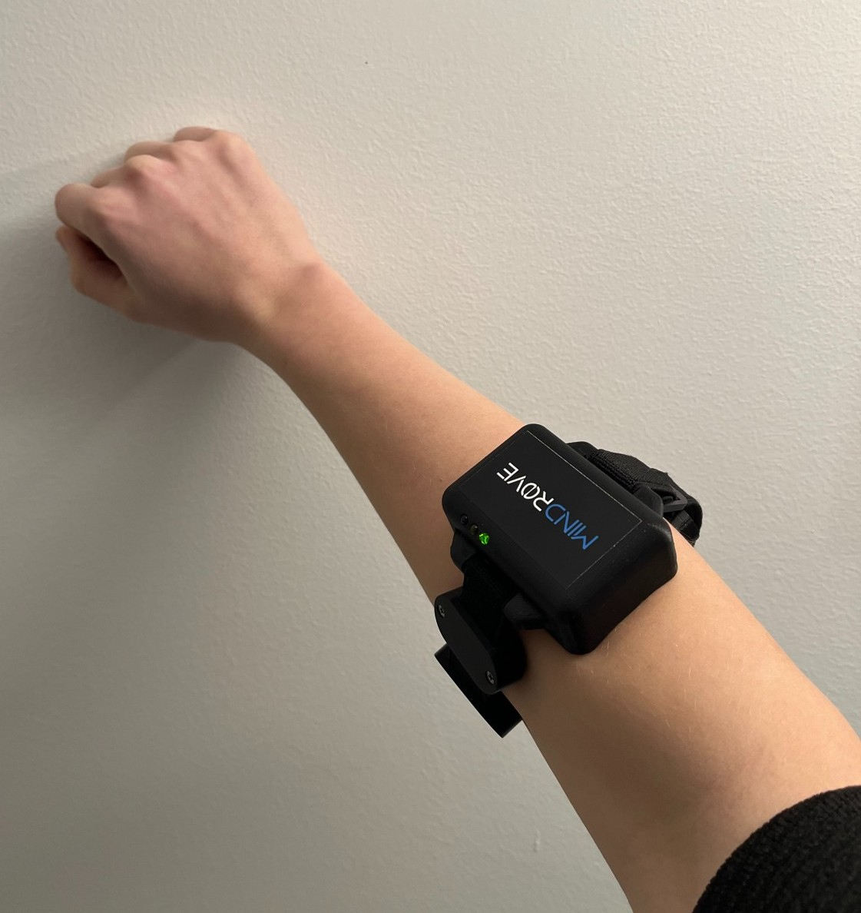

# NaviFlame
[MindRove](https://mindrove.com/)'s middle-sized AI system for detecting hand and finger motions from wearable sensor data.

The NaviFlame implements a pipeline for recording, fine-tuning, and performing real-time inference of gesture-based inputs using a MindRove device. The system incorporates signal processing, Deep Learning based feature extraction, MLP-based classification, and real-time visualization.
 <br>


## Features
- Record gestures with EMG data from the MindRove device.
- Fine-tune a hybrid Deep Learning plus MLP model for the user (only the MLP part has to be fine-tuned making the process super quick)
- Real-time AI inference and display of gesture predictions.
- A Unity-based application that visualizes data sent from `NaviFlame` via a socket.
 
 <br>

## Table of Contents
1. [Setup](#setup)
2. [Configuration](#configuration)
3. [Usage](#usage)
4. [Input Parameters](#input-parameters)
5. [System Pipeline](#system-pipeline)
6. [Unity Visualization](#unity-visualization)
7. [Contact](#contact)

 <br>

## Setup
### Requirements
- Python >=3.7 and <3.11.
- Libraries:
  - `tensorflow==2.12.0`
  - `scikit-learn`
  - `opencv-python`
  - `numpy`
  - `mindrove` (MindRove SDK)

### Installation
1. Clone this repository.
2. Install required dependencies:
   ```bash
   pip install -r requirements.txt
3. Ensure the MindRove device is properly placed and connected.

 <br>

## Configuration
All configuration settings are defined in the config.json file. Below are key variables to modify based on your requirements:

### Key Configuration Variables:
- Paths:
    - data_path: Path to save recorded gesture data.
    - feature_extractor_path: Path to the pretrained feature extractor AI model.
    - mlp_model_path: Path to save the trained MLP model.
    - scaler_path: Path to save the scaler used in feature scaling.
    - gesture_image_path: Directory containing gesture images.

- Flags:
    - record: Enables/disables gesture recording.
    - fine_tune: Enables/disables fine-tuning.
    - show_predicted_image: Enables displaying gesture images during inference.
    - send_to_socket: Sends predictions to a socket server.
### Other Configuration Variables:
- Data Parameters:
    - sampling_rate: Sampling rate for EMG data (default: 500 Hz).
    - model_input_len: Input length for gesture model (default: 100 samples).
    - filters: List of filters applied to preprocess EMG signals.

 <br>
    
## Usage
Please ensure that your MindRove device is correctly connected and positioned. In the right hand, the USB is distal (towards the back of the hand), 
in pronation (palm down on the table) the box is on the top of the arm. Please refer to the images for reference:
<div align="center">
  
</div>
For best performance, gestures should be smooth and consistent. Avoid movements that are too aggressive or too light, as either can lead to misinterpretation. Also, avoid sudden movements, as the system works best with controlled and deliberate gestures. A more seamless and responsive interaction experience can be achieved by performing each movement with a natural flow. Gesture 0 refers to the rest position, so make sure your hand is relaxed.

<br>

Run the example code: 
```python example.py```
### 1. Record Gestures
Run the example.py script with the record flag set to True to capture gestures.
### 2. Fine-Tune MLP Model
Set fine_tune to True in example.py. After recording gestures, the script will fine-tune the MLP model.
### 3. Real-Time Inference
Ensure recorded data exists and the model is fine-tuned. Run the inference example to perform real-time inference by 
```python inference_example.py```

 <br>

## Input Parameters

### Recording Parameters
| Parameter             | Description                                      | Default Value             |
|-----------------------|--------------------------------------------------|---------------------------|
| `filters`             | List of filters applied during recording.        | - |
| `data_path`           | Path to save the recorded data.                  | - |
| `gesture_image_path`  | Path to the gesture images.                      | `gestures/`               |
| `skip_gestures`       | List of gesture IDs to skip.                     | `[]`                      |
| `gestures_repeat`     | Number of repetitions for each gesture.          | `1`                       |
| `recording_time_sec`  | Duration to record each gesture.                 | `8` seconds               |
| `sampling_rate`       | Sampling rate of the MindRove board.             | `500` Hz                  |
| `model_input_len`     | Length of input data to the model.               | `100` samples             |
| `overlap_frac`        | Overlap fraction between samples.                | `10`                      |

### Fine-Tuning Parameters
| Parameter             | Description                                      | Default Value             |
|-----------------------|--------------------------------------------------|---------------------------|
| `feature_extractor_path` | Path to the feature extractor model.           | -    |
| `recorded_data`       | List of recorded data used for training.         | -                      |
| `recorded_labels`     | List of labels for the recorded data.            | -                       |
| `mlp_model_path`      | Path to save the trained MLP model.              | -      |
| `scaler_path`         | Path to save the scaler used for normalization.  | -         |


### Inference Parameters
| Parameter             | Description                                      | Default Value             |
|-----------------------|--------------------------------------------------|---------------------------|
| `feature_extractor_path` | Path to the feature extractor model.           | -    |
| `mlp_model_path`      | Path to the MLP model.                           | -      |
| `scaler_path`         | Path to the scaler used for normalization.       | -         |
| `filters`             | List of filters applied during inference.        | -  |
| `model_input_len`     | Length of input data to the model.               | `100` samples             |
| `gyro_threshold`      | Threshold for gyro data filtering.               | `500`                    |
| `prediction_threshold`| Confidence threshold for gesture predictions.    | `0.4`                     |
| `batch_size`          | Number of samples processed for one prediction.  | `5`                       |
 <br>


## System Pipeline
1. Data Recording:

  - The record_gestures function records EMG data from the MindRove board.
  - Signals are preprocessed using filters for noise reduction.
2. Fine-Tuning:

  - The fine_tune_model function extracts features and trains an MLP classifier.
  - Data is scaled, and model performance is validated.
3. Real-Time Inference:

  - The real_time_inference function processes live EMG data and predicts gestures.
  - Predictions are visualized and optionally sent via a socket connection.

 <br>

## Unity Visualization

### Description
The Unity application is designed to visualize the gestures detected by the `NaviFlame` system. It connects to the same socket used for data transmission and provides a real-time display of the gestures as 3D animations.
It visualizes the predicted gesture from your NaviFlame running in Python, so it is important to run the inference in Python to send data to the visualizer.

### Running the Unity Application
1. Decompress the zip file into a folder of your choice (e.g., NaviFlame_unity_visualizer/). 
2. Inside the decompressed folder, locate the NaviFlame_visualizer.exe file and run it to start the Unity application.
3. Ensure that the Unity application is run prior to the  NaviFlame. The visualizer will automatically connect to the socket and display the gestures real-time.
<div align="center">
  
</div>

 <br>

## Contact
For support, collaboration, or queries, please reach out via:
- **Email**: [info@mindrove.com](mailto:info@mindrove.com)
- **Website**: [MindRove](https://mindrove.com/)

